# Moss

Moss is a single-user, web-based LaTeX editor built with Next.js, Supabase, and a Rust compiler backend. It is designed to feel like an Overleaf-style editor while keeping project data in Supabase, uploaded assets in Supabase Storage, and compiled PDFs as direct preview/download artifacts.

The current production compiler path is:

```text
compiler/orchestrator: latexmk
engine: pdflatex
host: Render Docker web service
```

Generated PDFs are not stored in Supabase. They are returned to the browser as short-lived blobs for preview and download.

## Current Status

| Area | Current choice |
| --- | --- |
| Frontend | Next.js App Router, React, TypeScript |
| UI | shadcn/ui style components, Tailwind, lucide-react, Sonner |
| Code editor | Monaco |
| Visual editor | Tiptap-based LaTeX visual surface |
| Auth | Supabase Auth |
| Database | Supabase Postgres |
| File assets | Supabase Storage bucket `project-assets` |
| Compiler backend | Rust Axum service |
| Production compiler | `latexmk -> pdflatex` |
| Backend hosting | Render Docker web service |
| Frontend hosting target | Vercel |
| PDF output | Direct browser preview/download |
| Section model | Stored as first-class rows for future AI agents |

## Repository Layout

```text
moss/
  app/                     Next.js App Router pages
  components/              Main Moss editor UI and PDF preview
  lib/                     Supabase client, compiler client, LaTeX parsing, linting
  types/                   Shared frontend TypeScript types
  supabase/migrations/     Postgres schema, RLS, storage policies
  backend/                 Rust Axum compiler backend
  render.yaml              Render Docker service blueprint
  delete.md                Notes for files to remove later
```

## Architecture Summary

Moss separates project persistence from compilation:

- Supabase is the source of truth for projects, text files, metadata, citations, and sections.
- Supabase Storage stores uploaded binary assets such as images, diagrams, PDFs, `.cls`, `.sty`, and other asset files when needed.
- The Rust backend receives the current project file tree, writes it into a temporary workspace, runs `latexmk`, returns a PDF, logs, diagnostics, and SyncTeX metadata.
- The browser previews the PDF using `pdfjs-dist`, supports downloads, and can call SyncTeX reverse lookup to jump from preview text back to source lines.

## System Context

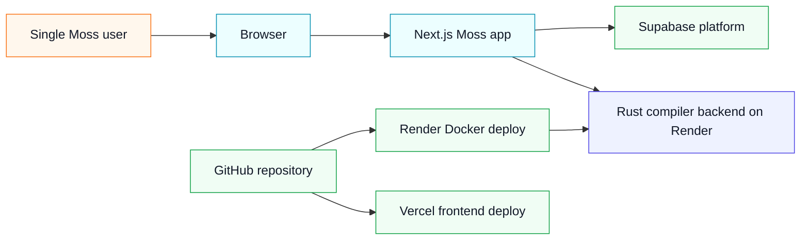
```mermaid
flowchart LR
  user["Single Moss user"]
  browser["Browser"]
  app["Next.js Moss app"]
  supabase["Supabase platform"]
  compiler["Rust compiler backend on Render"]
  github["GitHub repository"]
  render["Render Docker deploy"]
  vercel["Vercel frontend deploy"]

  user --> browser
  browser --> app
  app --> supabase
  app --> compiler
  github --> render
  github --> vercel
  render --> compiler

  classDef human fill:#fff7ed,stroke:#f97316,color:#111827;
  classDef client fill:#ecfeff,stroke:#0891b2,color:#111827;
  classDef service fill:#eef2ff,stroke:#4f46e5,color:#111827;
  classDef platform fill:#f0fdf4,stroke:#16a34a,color:#111827;
  class user human;
  class browser,app client;
  class compiler service;
  class supabase,github,render,vercel platform;
```

## Container Diagram

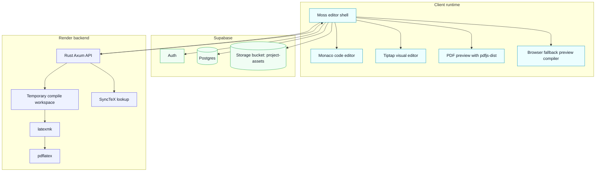
```mermaid
flowchart TB
  subgraph client["Client runtime"]
    ui["Moss editor shell"]
    monaco["Monaco code editor"]
    visual["Tiptap visual editor"]
    pdfPreview["PDF preview with pdfjs-dist"]
    localPreview["Browser fallback preview compiler"]
  end

  subgraph supabase["Supabase"]
    auth["Auth"]
    db[("Postgres")]
    storage[("Storage bucket: project-assets")]
  end

  subgraph backend["Render backend"]
    axum["Rust Axum API"]
    temp["Temporary compile workspace"]
    latexmk["latexmk"]
    pdflatex["pdflatex"]
    synctex["SyncTeX lookup"]
  end

  ui --> monaco
  ui --> visual
  ui --> pdfPreview
  ui --> localPreview
  ui --> auth
  ui --> db
  ui --> storage
  ui --> axum
  axum --> temp
  temp --> latexmk
  latexmk --> pdflatex
  axum --> synctex
  axum --> ui

  classDef client fill:#ecfeff,stroke:#0891b2,color:#111827;
  classDef data fill:#f0fdf4,stroke:#16a34a,color:#111827;
  classDef service fill:#eef2ff,stroke:#4f46e5,color:#111827;
  class ui,monaco,visual,pdfPreview,localPreview client;
  class auth,db,storage data;
  class axum,temp,latexmk,pdflatex,synctex service;
```

## Component Diagram

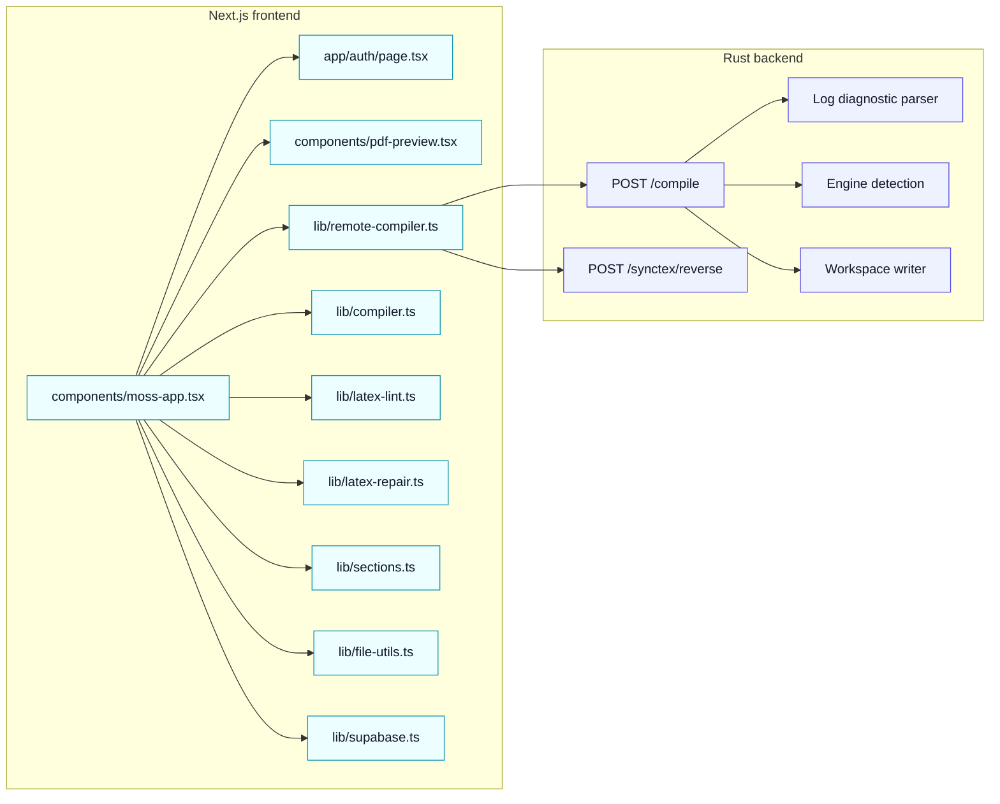
```mermaid
flowchart LR
  subgraph frontend["Next.js frontend"]
    authPage["app/auth/page.tsx"]
    appShell["components/moss-app.tsx"]
    pdfComp["components/pdf-preview.tsx"]
    remoteClient["lib/remote-compiler.ts"]
    localClient["lib/compiler.ts"]
    lint["lib/latex-lint.ts"]
    repair["lib/latex-repair.ts"]
    sections["lib/sections.ts"]
    fileUtils["lib/file-utils.ts"]
    supaClient["lib/supabase.ts"]
  end

  subgraph backend["Rust backend"]
    api["POST /compile"]
    reverse["POST /synctex/reverse"]
    diagnostics["Log diagnostic parser"]
    engineDetect["Engine detection"]
    workspace["Workspace writer"]
  end

  appShell --> authPage
  appShell --> pdfComp
  appShell --> remoteClient
  appShell --> localClient
  appShell --> lint
  appShell --> repair
  appShell --> sections
  appShell --> fileUtils
  appShell --> supaClient
  remoteClient --> api
  remoteClient --> reverse
  api --> engineDetect
  api --> workspace
  api --> diagnostics

  classDef ui fill:#ecfeff,stroke:#0891b2,color:#111827;
  classDef backend fill:#eef2ff,stroke:#4f46e5,color:#111827;
  class authPage,appShell,pdfComp,remoteClient,localClient,lint,repair,sections,fileUtils,supaClient ui;
  class api,reverse,diagnostics,engineDetect,workspace backend;
```

## Compile Sequence

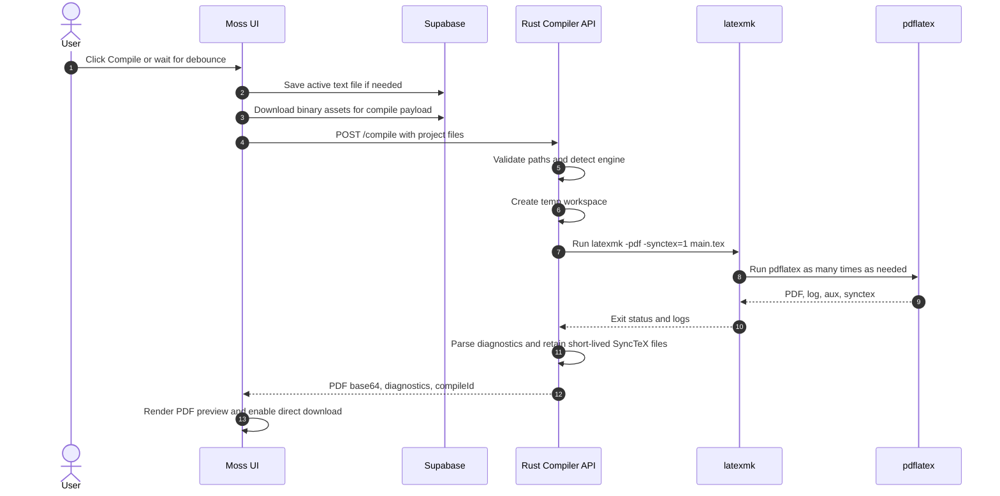
```mermaid
sequenceDiagram
  autonumber
  actor User
  participant UI as Moss UI
  participant Supabase as Supabase
  participant API as Rust Compiler API
  participant Latexmk as latexmk
  participant PdfLaTeX as pdflatex

  User->>UI: Click Compile or wait for debounce
  UI->>Supabase: Save active text file if needed
  UI->>Supabase: Download binary assets for compile payload
  UI->>API: POST /compile with project files
  API->>API: Validate paths and detect engine
  API->>API: Create temp workspace
  API->>Latexmk: Run latexmk -pdf -synctex=1 main.tex
  Latexmk->>PdfLaTeX: Run pdflatex as many times as needed
  PdfLaTeX-->>Latexmk: PDF, log, aux, synctex
  Latexmk-->>API: Exit status and logs
  API->>API: Parse diagnostics and retain short-lived SyncTeX files
  API-->>UI: PDF base64, diagnostics, compileId
  UI->>UI: Render PDF preview and enable direct download
```

## SyncTeX Reverse Lookup

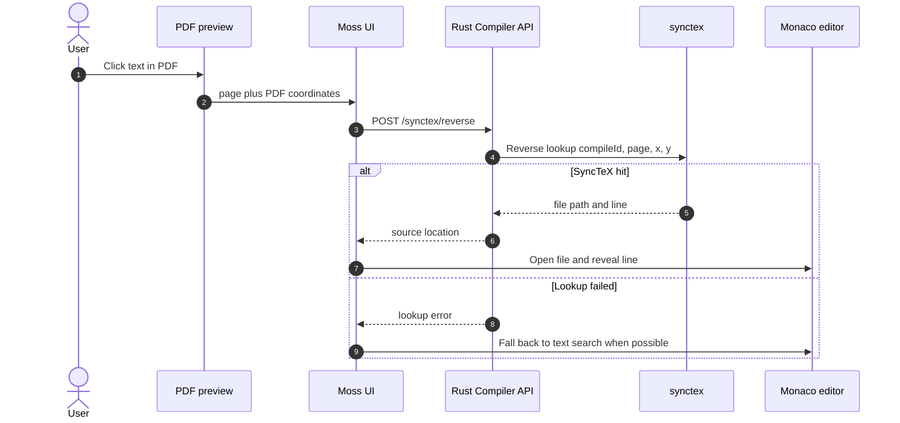
```mermaid
sequenceDiagram
  autonumber
  actor User
  participant Preview as PDF preview
  participant UI as Moss UI
  participant API as Rust Compiler API
  participant SyncTeX as synctex
  participant Editor as Monaco editor

  User->>Preview: Click text in PDF
  Preview->>UI: page plus PDF coordinates
  UI->>API: POST /synctex/reverse
  API->>SyncTeX: Reverse lookup compileId, page, x, y
  alt SyncTeX hit
    SyncTeX-->>API: file path and line
    API-->>UI: source location
    UI->>Editor: Open file and reveal line
  else Lookup failed
    API-->>UI: lookup error
    UI->>Editor: Fall back to text search when possible
  end
```

## Data Flow Diagram

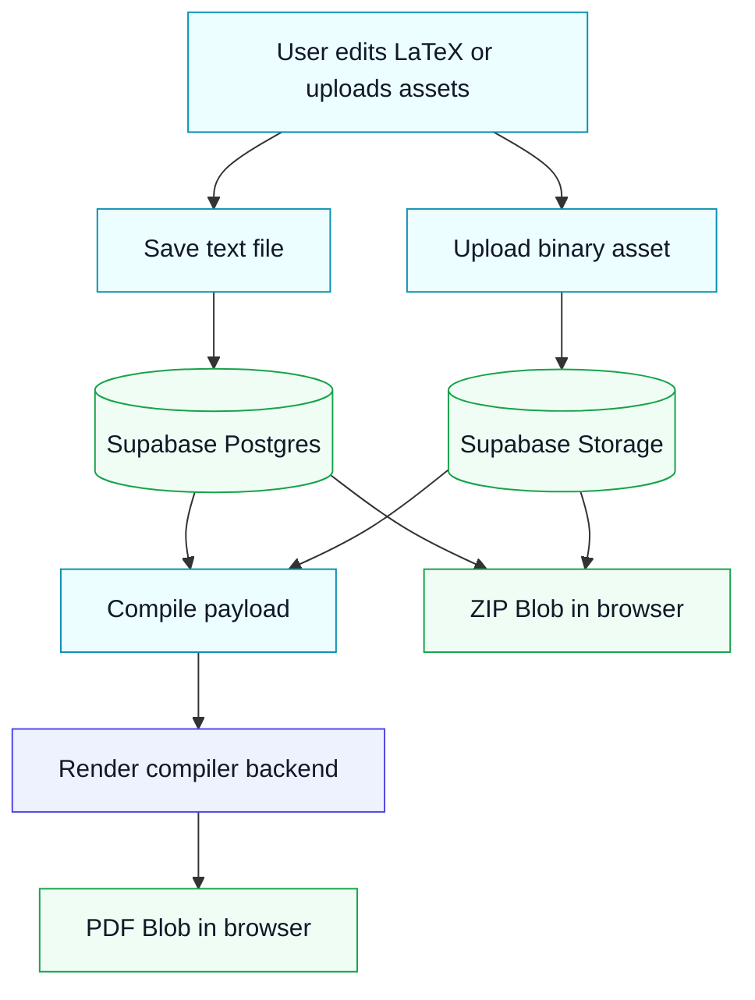
```mermaid
flowchart TD
  input["User edits LaTeX or uploads assets"]
  saveText["Save text file"]
  uploadAsset["Upload binary asset"]
  postgres[("Supabase Postgres")]
  storage[("Supabase Storage")]
  compilePayload["Compile payload"]
  renderBackend["Render compiler backend"]
  pdfBlob["PDF Blob in browser"]
  zipBlob["ZIP Blob in browser"]

  input --> saveText
  input --> uploadAsset
  saveText --> postgres
  uploadAsset --> storage
  postgres --> compilePayload
  storage --> compilePayload
  compilePayload --> renderBackend
  renderBackend --> pdfBlob
  postgres --> zipBlob
  storage --> zipBlob

  classDef action fill:#ecfeff,stroke:#0891b2,color:#111827;
  classDef data fill:#f0fdf4,stroke:#16a34a,color:#111827;
  classDef service fill:#eef2ff,stroke:#4f46e5,color:#111827;
  class input,saveText,uploadAsset,compilePayload action;
  class postgres,storage,pdfBlob,zipBlob data;
  class renderBackend service;
```

## Database ERD

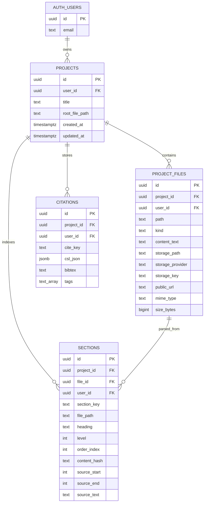
```mermaid
erDiagram
  AUTH_USERS ||--o{ PROJECTS : owns
  PROJECTS ||--o{ PROJECT_FILES : contains
  PROJECTS ||--o{ SECTIONS : indexes
  PROJECTS ||--o{ CITATIONS : stores
  PROJECT_FILES ||--o{ SECTIONS : parsed_from

  AUTH_USERS {
    uuid id PK
    text email
  }

  PROJECTS {
    uuid id PK
    uuid user_id FK
    text title
    text root_file_path
    timestamptz created_at
    timestamptz updated_at
  }

  PROJECT_FILES {
    uuid id PK
    uuid project_id FK
    uuid user_id FK
    text path
    text kind
    text content_text
    text storage_path
    text storage_provider
    text storage_key
    text public_url
    text mime_type
    bigint size_bytes
  }

  SECTIONS {
    uuid id PK
    uuid project_id FK
    uuid file_id FK
    uuid user_id FK
    text section_key
    text file_path
    text heading
    int level
    int order_index
    text content_hash
    int source_start
    int source_end
    text source_text
  }

  CITATIONS {
    uuid id PK
    uuid project_id FK
    uuid user_id FK
    text cite_key
    jsonb csl_json
    text bibtex
    text_array tags
  }
```

## Domain Class Diagram

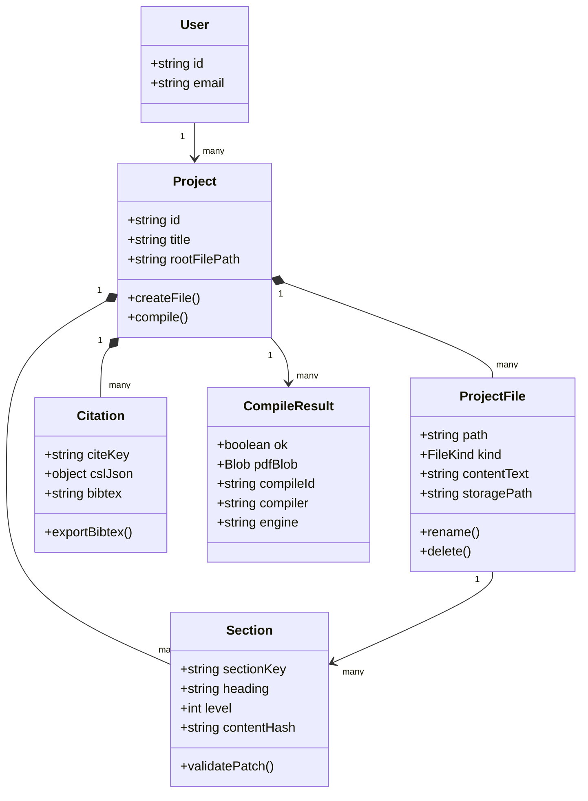
```mermaid
classDiagram
  class User {
    +string id
    +string email
  }

  class Project {
    +string id
    +string title
    +string rootFilePath
    +createFile()
    +compile()
  }

  class ProjectFile {
    +string path
    +FileKind kind
    +string contentText
    +string storagePath
    +rename()
    +delete()
  }

  class Section {
    +string sectionKey
    +string heading
    +int level
    +string contentHash
    +validatePatch()
  }

  class Citation {
    +string citeKey
    +object cslJson
    +string bibtex
    +exportBibtex()
  }

  class CompileResult {
    +boolean ok
    +Blob pdfBlob
    +string compileId
    +string compiler
    +string engine
  }

  User "1" --> "many" Project
  Project "1" *-- "many" ProjectFile
  Project "1" *-- "many" Section
  Project "1" *-- "many" Citation
  Project "1" --> "many" CompileResult
  ProjectFile "1" --> "many" Section
```

## Project Lifecycle State Diagram

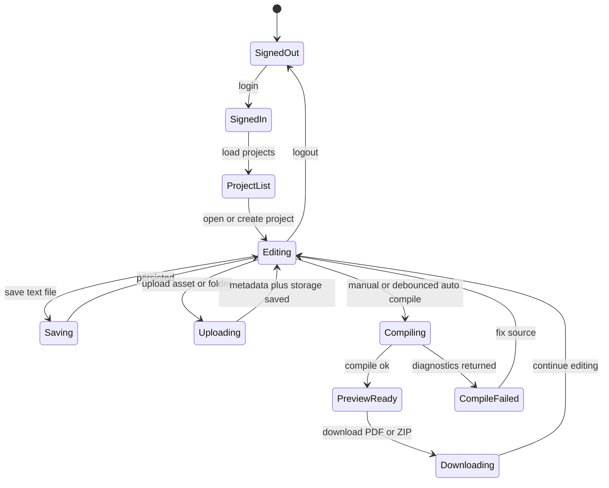
```mermaid
stateDiagram-v2
  [*] --> SignedOut
  SignedOut --> SignedIn: login
  SignedIn --> ProjectList: load projects
  ProjectList --> Editing: open or create project
  Editing --> Saving: save text file
  Saving --> Editing: persisted
  Editing --> Uploading: upload asset or folder
  Uploading --> Editing: metadata plus storage saved
  Editing --> Compiling: manual or debounced auto compile
  Compiling --> PreviewReady: compile ok
  Compiling --> CompileFailed: diagnostics returned
  PreviewReady --> Downloading: download PDF or ZIP
  Downloading --> Editing: continue editing
  CompileFailed --> Editing: fix source
  Editing --> SignedOut: logout
```

## Compiler State Diagram

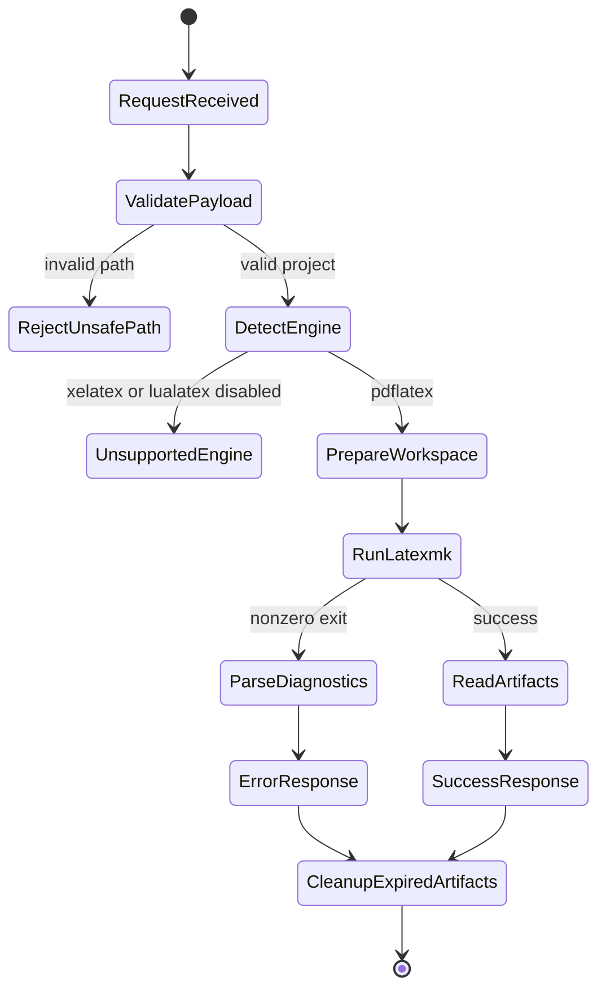
```mermaid
stateDiagram-v2
  [*] --> RequestReceived
  RequestReceived --> ValidatePayload
  ValidatePayload --> RejectUnsafePath: invalid path
  ValidatePayload --> DetectEngine: valid project
  DetectEngine --> UnsupportedEngine: xelatex or lualatex disabled
  DetectEngine --> PrepareWorkspace: pdflatex
  PrepareWorkspace --> RunLatexmk
  RunLatexmk --> ParseDiagnostics: nonzero exit
  RunLatexmk --> ReadArtifacts: success
  ParseDiagnostics --> ErrorResponse
  ReadArtifacts --> SuccessResponse
  ErrorResponse --> CleanupExpiredArtifacts
  SuccessResponse --> CleanupExpiredArtifacts
  CleanupExpiredArtifacts --> [*]
```

## User Journey

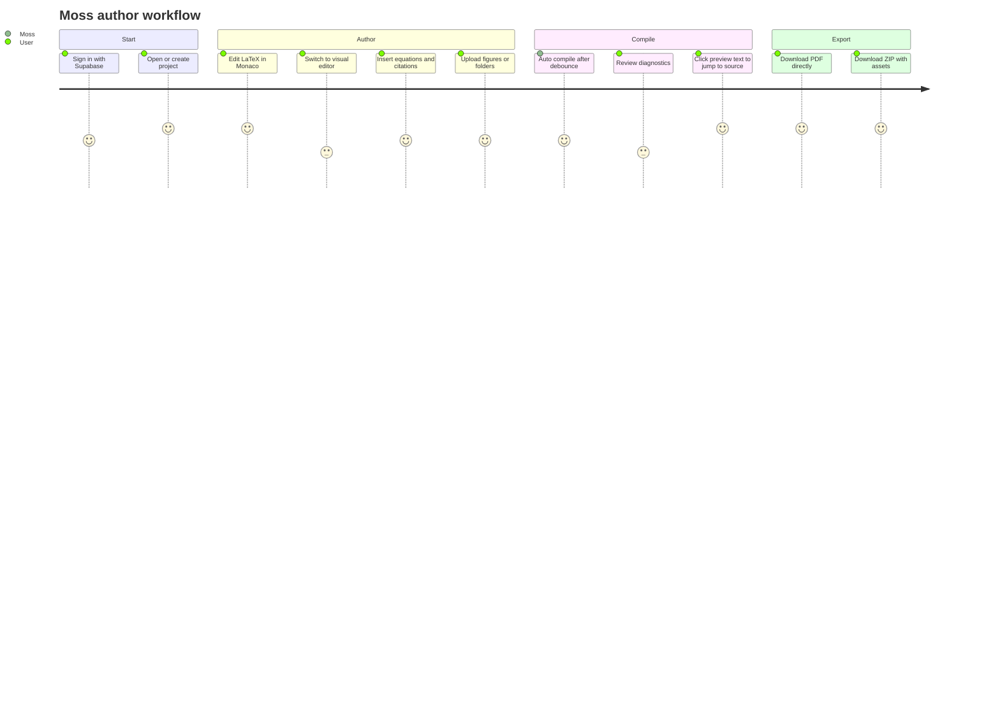
```mermaid
journey
  title Moss author workflow
  section Start
    Sign in with Supabase: 4: User
    Open or create project: 5: User
  section Author
    Edit LaTeX in Monaco: 5: User
    Switch to visual editor: 3: User
    Insert equations and citations: 4: User
    Upload figures or folders: 4: User
  section Compile
    Auto compile after debounce: 4: Moss
    Review diagnostics: 3: User
    Click preview text to jump to source: 5: User
  section Export
    Download PDF directly: 5: User
    Download ZIP with assets: 5: User
```

## Deployment Diagram

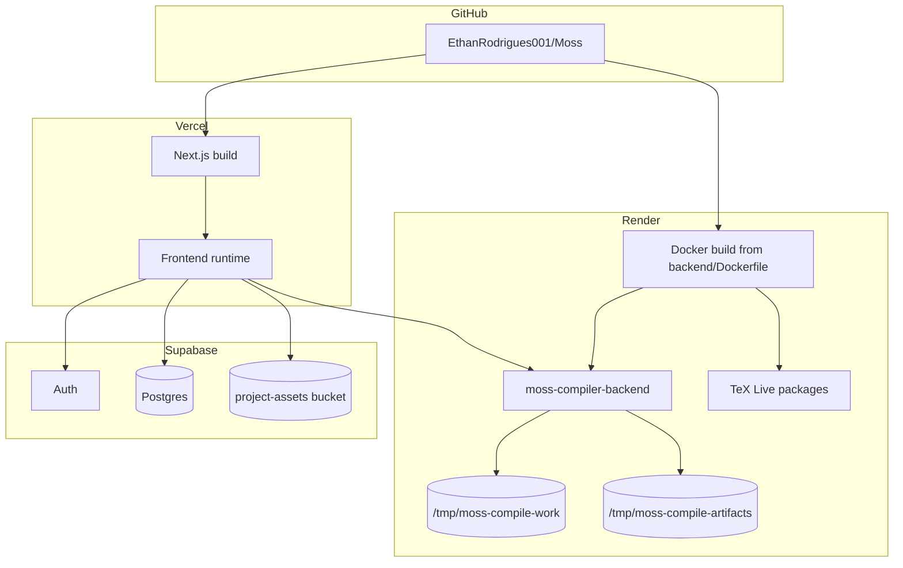
```mermaid
flowchart TB
  subgraph github["GitHub"]
    repo["EthanRodrigues001/Moss"]
  end

  subgraph vercel["Vercel"]
    nextBuild["Next.js build"]
    nextRuntime["Frontend runtime"]
  end

  subgraph render["Render"]
    dockerBuild["Docker build from backend/Dockerfile"]
    rustBinary["moss-compiler-backend"]
    texlive["TeX Live packages"]
    tmpWork[("/tmp/moss-compile-work")]
    tmpArtifacts[("/tmp/moss-compile-artifacts")]
  end

  subgraph supabase["Supabase"]
    auth["Auth"]
    db[("Postgres")]
    assets[("project-assets bucket")]
  end

  repo --> nextBuild
  repo --> dockerBuild
  nextBuild --> nextRuntime
  dockerBuild --> rustBinary
  dockerBuild --> texlive
  rustBinary --> tmpWork
  rustBinary --> tmpArtifacts
  nextRuntime --> auth
  nextRuntime --> db
  nextRuntime --> assets
  nextRuntime --> rustBinary
```

## Render Runtime

The Render backend is a Docker web service using `backend/Dockerfile`.

```text
Render service: moss-compiler
Root directory: backend
Runtime: Docker
Plan: Free
Health check: /health
Compiler mode: latexmk
Primary engine: pdflatex
```

Render environment variables:

```env
CORS_ORIGIN=*
MAX_UPLOAD_MB=80
COMPILE_TIMEOUT_MS=60000
MOSS_COMPILER_ENGINE=latexmk
LATEXMK_BIN=latexmk
SYNCTEX_BIN=synctex
ENABLE_XELATEX=false
ENABLE_LUALATEX=false
COMPILE_WORK_DIR=/tmp/moss-compile-work
COMPILE_ARTIFACT_DIR=/tmp/moss-compile-artifacts
COMPILE_ARTIFACT_TTL_MS=600000
```

## CI and Deployment Flow


```mermaid
flowchart LR
  edit["Local code changes"]
  checks["cargo check and cargo test"]
  commit["Git commit"]
  push["Push to GitHub main"]
  renderDeploy["Render deploy"]
  health["GET /health"]
  frontendEnv["Set NEXT_PUBLIC_COMPILER_API_URL"]
  smoke["Compile smoke test from Moss UI"]

  edit --> checks
  checks --> commit
  commit --> push
  push --> renderDeploy
  renderDeploy --> health
  health --> frontendEnv
  frontendEnv --> smoke
```

## Git History Shape

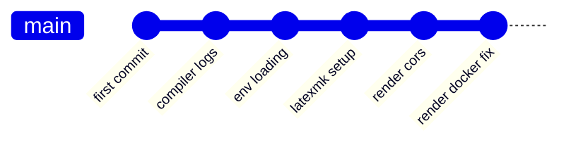
```mermaid
gitGraph
  commit id: "first commit"
  commit id: "compiler logs"
  commit id: "env loading"
  commit id: "latexmk setup"
  commit id: "render cors"
  commit id: "render docker fix"
```

## Compiler Decision Timeline

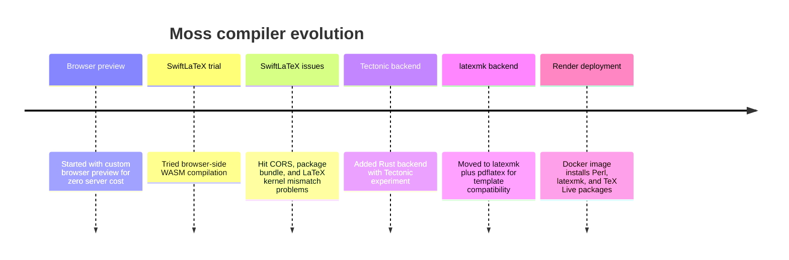
```mermaid
timeline
  title Moss compiler evolution
  Browser preview : Started with custom browser preview for zero server cost
  SwiftLaTeX trial : Tried browser-side WASM compilation
  SwiftLaTeX issues : Hit CORS, package bundle, and LaTeX kernel mismatch problems
  Tectonic backend : Added Rust backend with Tectonic experiment
  latexmk backend : Moved to latexmk plus pdflatex for template compatibility
  Render deployment : Docker image installs Perl, latexmk, and TeX Live packages
```

## Roadmap Gantt

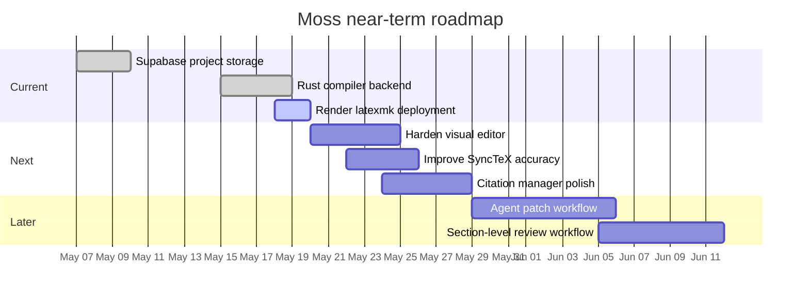
```mermaid
gantt
  title Moss near-term roadmap
  dateFormat  YYYY-MM-DD
  axisFormat  %b %d

  section Current
  Supabase project storage        :done,    a1, 2026-05-07, 3d
  Rust compiler backend           :done,    a2, 2026-05-15, 4d
  Render latexmk deployment       :active,  a3, 2026-05-18, 2d

  section Next
  Harden visual editor            :         b1, 2026-05-20, 5d
  Improve SyncTeX accuracy        :         b2, 2026-05-22, 4d
  Citation manager polish         :         b3, 2026-05-24, 5d

  section Later
  Agent patch workflow            :         c1, 2026-05-29, 8d
  Section-level review workflow   :         c2, 2026-06-05, 7d
```

## Storage Responsibility Pie

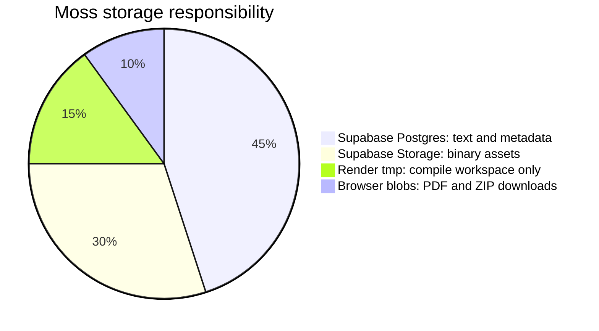
```mermaid
pie title Moss storage responsibility
  "Supabase Postgres: text and metadata" : 45
  "Supabase Storage: binary assets" : 30
  "Render tmp: compile workspace only" : 15
  "Browser blobs: PDF and ZIP downloads" : 10
```

## Requirement Diagram

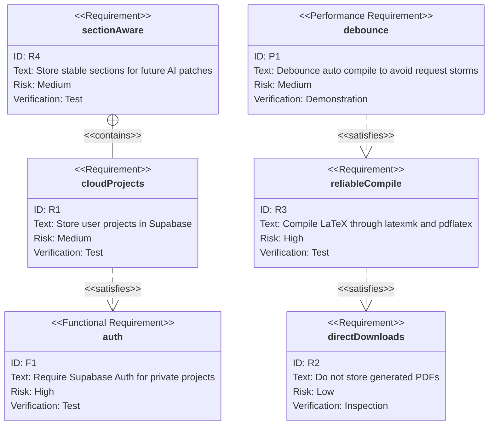
```mermaid
requirementDiagram
  requirement cloudProjects {
    id: R1
    text: Store user projects in Supabase
    risk: medium
    verifymethod: test
  }

  requirement directDownloads {
    id: R2
    text: Do not store generated PDFs
    risk: low
    verifymethod: inspection
  }

  requirement reliableCompile {
    id: R3
    text: Compile LaTeX through latexmk and pdflatex
    risk: high
    verifymethod: test
  }

  requirement sectionAware {
    id: R4
    text: Store stable sections for future AI patches
    risk: medium
    verifymethod: test
  }

  functionalRequirement auth {
    id: F1
    text: Require Supabase Auth for private projects
    risk: high
    verifymethod: test
  }

  performanceRequirement debounce {
    id: P1
    text: Debounce auto compile to avoid request storms
    risk: medium
    verifymethod: demonstration
  }

  cloudProjects - satisfies -> auth
  reliableCompile - satisfies -> directDownloads
  sectionAware - contains -> cloudProjects
  debounce - satisfies -> reliableCompile
```

## Mind Map

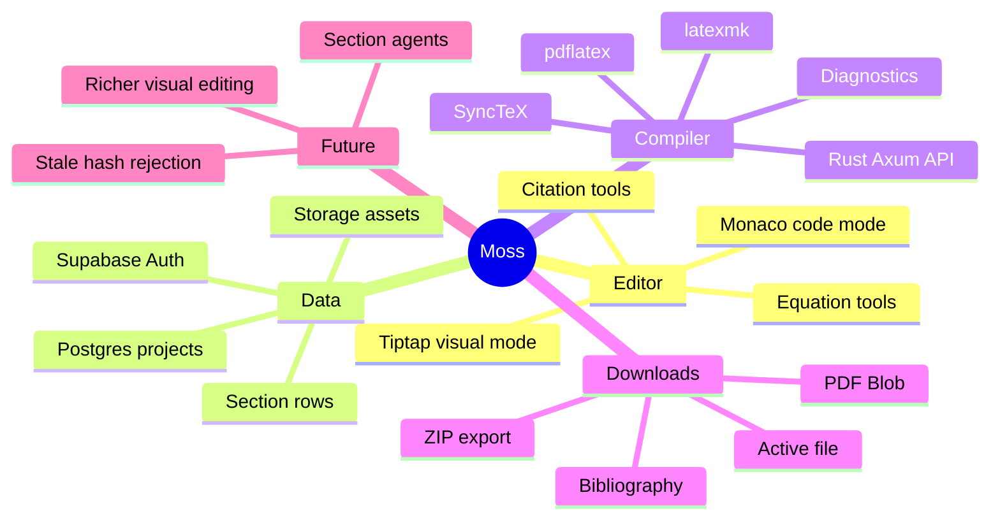
```mermaid
mindmap
  root((Moss))
    Editor
      Monaco code mode
      Tiptap visual mode
      Equation tools
      Citation tools
    Data
      Supabase Auth
      Postgres projects
      Storage assets
      Section rows
    Compiler
      Rust Axum API
      latexmk
      pdflatex
      SyncTeX
      Diagnostics
    Downloads
      PDF Blob
      ZIP export
      Active file
      Bibliography
    Future
      Section agents
      Stale hash rejection
      Richer visual editing
```

## Architecture Quadrant

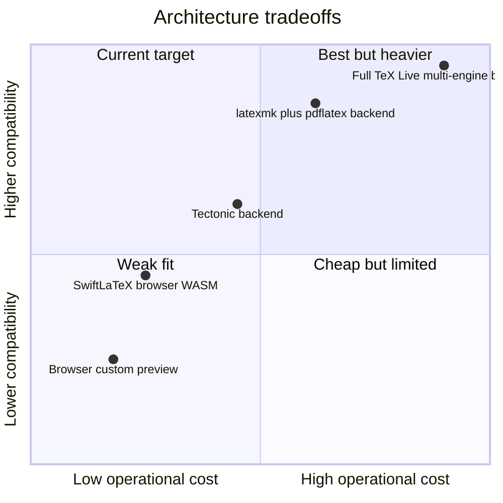
```mermaid
quadrantChart
  title Architecture tradeoffs
  x-axis Low operational cost --> High operational cost
  y-axis Lower compatibility --> Higher compatibility
  quadrant-1 Best but heavier
  quadrant-2 Current target
  quadrant-3 Weak fit
  quadrant-4 Cheap but limited
  Browser custom preview: [0.18, 0.25]
  SwiftLaTeX browser WASM: [0.25, 0.45]
  Tectonic backend: [0.45, 0.62]
  latexmk plus pdflatex backend: [0.62, 0.86]
  Full TeX Live multi-engine backend: [0.9, 0.95]
```

## Compiler Model

Moss distinguishes the build tool from the TeX engine:

```text
latexmk = compiler orchestrator
pdflatex = TeX engine
```

`latexmk` decides how many times to run the underlying tools. A normal project may need:

```text
pdflatex
bibtex
pdflatex
pdflatex
```

Moss delegates this logic to `latexmk` instead of manually guessing reruns.

Engine detection currently recognizes:

| Engine marker | Result |
| --- | --- |
| normal LaTeX document | `pdflatex` |
| `% !TEX program = xelatex` | XeLaTeX detected |
| `\usepackage{fontspec}` | XeLaTeX detected |
| `% !TEX program = lualatex` | LuaLaTeX detected |

On Render, XeLaTeX and LuaLaTeX are disabled by default:

```env
ENABLE_XELATEX=false
ENABLE_LUALATEX=false
```

This keeps the free Docker image smaller and focused on the most compatible current path.

## API Contract

### Health

```http
GET /health
```

```json
{ "ok": true, "compiler": "moss-compiler" }
```

### Compile

```http
POST /compile
```

Request:

```json
{
  "projectTitle": "Moss Draft",
  "rootFilePath": "main.tex",
  "files": [
    {
      "path": "main.tex",
      "contentText": "\\documentclass{article}\\begin{document}Hi\\end{document}"
    },
    {
      "path": "figures/diagram.png",
      "contentBase64": "..."
    }
  ]
}
```

Success response:

```json
{
  "ok": true,
  "compileId": "short-lived-id",
  "compiler": "latexmk",
  "engine": "pdflatex",
  "durationMs": 1234,
  "filename": "Moss_Draft.pdf",
  "pdfBase64": "...",
  "log": "Recompiled with Moss pdflatex compiler in 1234 ms.",
  "diagnostics": [],
  "synctexAvailable": true
}
```

### Reverse SyncTeX

```http
POST /synctex/reverse
```

Request:

```json
{
  "compileId": "short-lived-id",
  "page": 1,
  "x": 120,
  "y": 240
}
```

Response:

```json
{
  "ok": true,
  "filePath": "main.tex",
  "line": 42
}
```

## Local Development

Install frontend dependencies:

```bash
npm install
```

Run the Next.js app:

```bash
npm run dev
```

Run the Rust compiler backend:

```bash
cd backend
cargo run
```

Required frontend environment variables:

```env
NEXT_PUBLIC_SUPABASE_URL=...
NEXT_PUBLIC_SUPABASE_ANON_KEY=...
NEXT_PUBLIC_COMPILER_API_URL=http://localhost:8787
```

Useful backend environment variables:

```env
PORT=8787
CORS_ORIGIN=http://localhost:3000
MAX_UPLOAD_MB=80
COMPILE_TIMEOUT_MS=60000
MOSS_COMPILER_ENGINE=latexmk
LATEXMK_BIN=latexmk
SYNCTEX_BIN=synctex
COMPILE_WORK_DIR=.compile-tmp
COMPILE_ARTIFACT_DIR=
COMPILE_ARTIFACT_TTL_MS=600000
```

On Windows with MiKTeX and Strawberry Perl, local development can set:

```env
LATEXMK_BIN='C:\Users\Ethan Rodrigues\AppData\Local\Programs\MiKTeX\miktex\bin\x64\latexmk.exe'
COMPILER_EXTRA_PATH='C:\Strawberry\perl\bin;C:\Strawberry\c\bin;C:\Users\Ethan Rodrigues\AppData\Local\Programs\MiKTeX\miktex\bin\x64'
```

## Supabase Model

The core Supabase objects are:

- `projects`: project metadata and root file path.
- `project_files`: file tree rows. Text files use `content_text`; binary files use `storage_path`.
- `sections`: parsed LaTeX sections with stable `section_key`, `source_text`, and `content_hash`.
- `citations`: CSL JSON, BibTeX, tags, and cite keys.
- `project-assets`: private Supabase Storage bucket for uploaded binaries.

Row Level Security ensures users can only access their own projects, files, sections, citations, and storage paths.

## Section-Aware Agent Foundation

Moss stores sections as first-class entities so later AI agents can work on smaller, stable document regions.

Future patch contract:

```ts
type SectionPatch = {
  sectionId: string;
  beforeHash: string;
  replacementLatex: string;
};
```

The intended safety rule is:

```text
Accept patch only if section.content_hash === beforeHash
```

That prevents an agent from overwriting a section that changed after it was read.

## Current Tradeoffs

| Decision | Why |
| --- | --- |
| Use `latexmk -> pdflatex` on Render | Best current compatibility for IEEE, article, BibTeX, figures, and standard templates |
| Disable XeLaTeX/LuaLaTeX on Render | Keeps free Docker image smaller and avoids missing engine surprises |
| Store generated PDFs only in browser | Avoids storage cost and stale compiled artifacts |
| Use Supabase Storage for assets | Keeps diagrams and uploaded files private and project-scoped |
| Keep Tectonic support in backend code | Useful as optional fallback where installed, but not part of Render image right now |
| Keep browser preview fallback | Lets the UI still show something if remote compiler is not configured |

## Verification

Recent checks used during the compiler and Render setup:

```bash
cd backend
cargo check
cargo test
```

Expected backend health response:

```bash
curl https://YOUR-RENDER-SERVICE.onrender.com/health
```

```json
{ "ok": true, "compiler": "moss-compiler" }
```

## Deployment Notes

Render deployment should use:

```text
Service type: Web Service
Runtime: Docker
Root directory: backend
Branch: main
Instance type: Free
```

Do not deploy the compiler backend as a Node service. If Render shows `npm install` and `npm run start`, switch the language/runtime to Docker.

After Render deploys, set this in the frontend environment:

```env
NEXT_PUBLIC_COMPILER_API_URL=https://YOUR-RENDER-SERVICE.onrender.com
```

Then restart the frontend.
